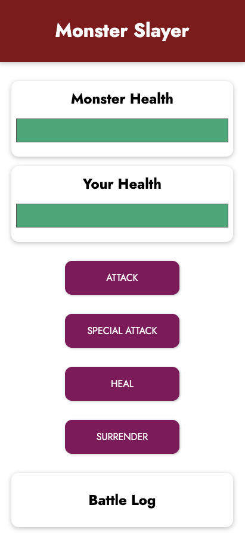
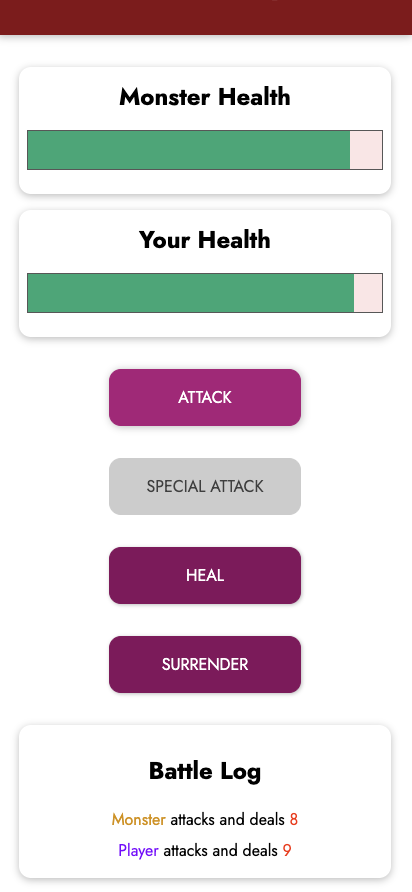
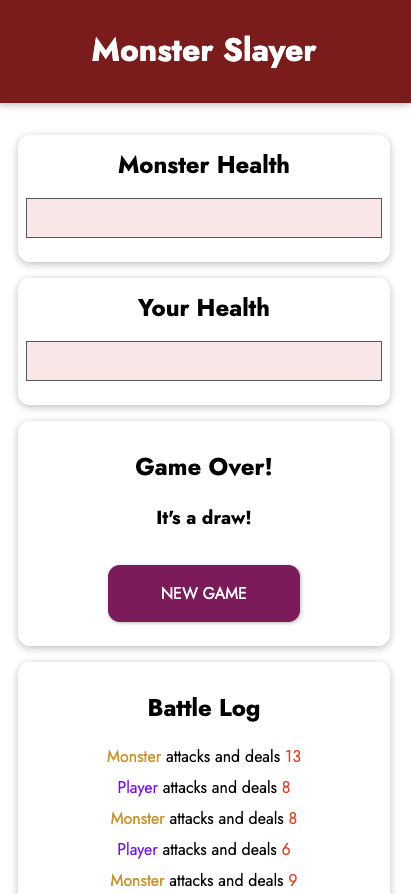
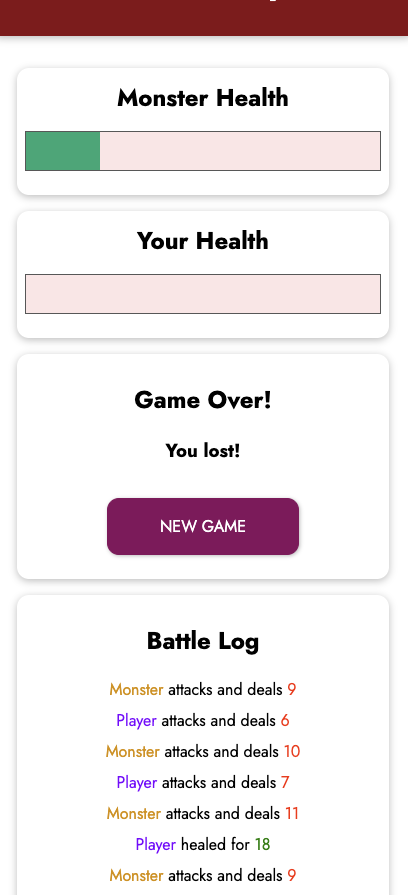
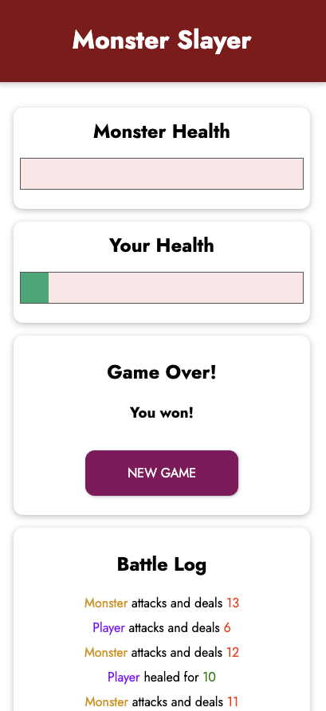
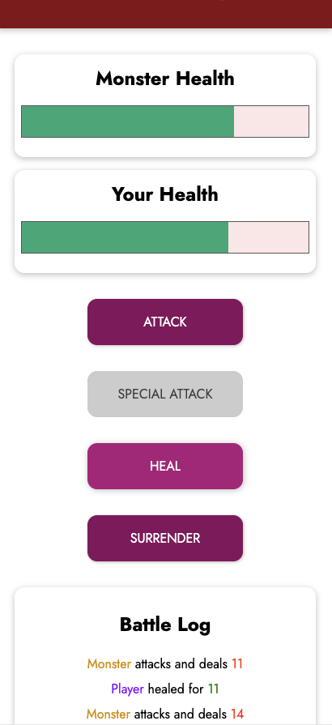

# Attack a Monster Game

This is a tutorial based from Maximilian Schwarzmüller. Vue Udemy Course Link in the resource section. 

A simple game that the player can attack a monster. 

Aim of this project is to practice Vue concepts.

___

## Features

* Attack a Monster
* Monster Attacks back 
* Heal
* Special Attack that deals more damage
* Surrender without dying 
* Battle Log 
* New Game 
* Random attack and heal values
* Responsive if you surrender, lost, win or it's a draw

___

## First Attempt Screenshots

____

## Resources 
Link to Udemy Tutorial: https://entainaustralia.udemy.com/course/vuejs-2-the-complete-guide/learn/lecture/21463348#overview